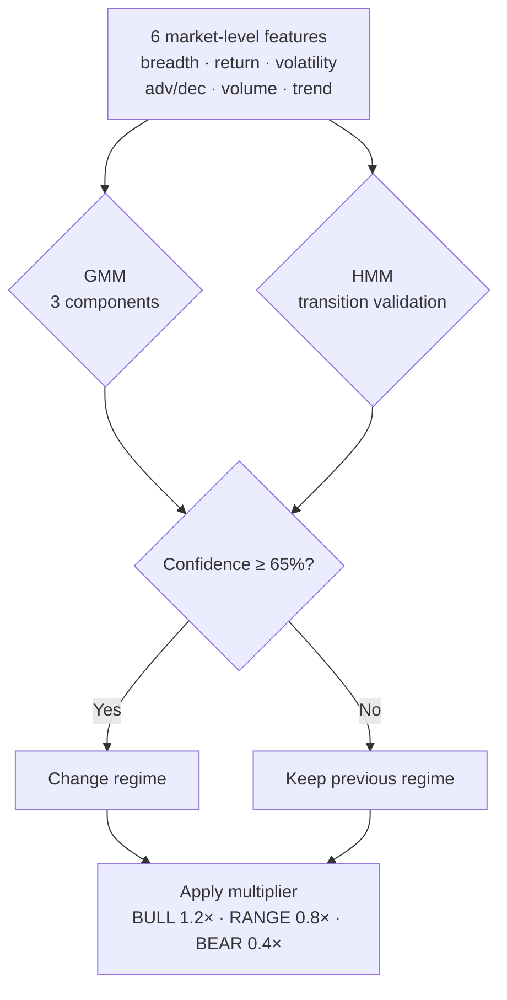

<div align="center">

# 📈 NEPSE AutoScan

### Automated Stock Scanner & ML Trading Signal System for Nepal Stock Exchange (NEPSE)

[](https://python.org)
[](https://pytorch.org)
[](https://xgboost.readthedocs.io)
[](https://lightgbm.readthedocs.io)
[]()
[](LICENSE)
[](https://padam56.github.io/nepse-autoscan/)

**NEPSE stock analysis** · **algorithmic trading signals** · **portfolio tracking** · **automated daily reports**

### [>> Live Dashboard <<](https://padam56.github.io/nepse-autoscan/)

---

An open-source quantitative trading system that scans **310+ NEPSE-listed stocks** every trading morning using **XGBoost, LightGBM, and GRU deep learning models**, detects market regimes, applies risk controls, and delivers ranked stock picks with Kelly-optimal position sizing — completely autonomous, running on a GPU server with daily email reports.

Built for retail investors in Nepal who want data-driven decisions without staring at charts all day.

[Overview](#-overview) · [How It Works](#-how-it-works) · [Sample Report](#-sample-report) · [Live Dashboard](https://padam56.github.io/nepse-autoscan/) · [Performance](PERFORMANCE.md) · [Models](#-models-in-depth) · [Setup](#-setup) · [Architecture](#-architecture)

</div>

<!--
Keywords for discoverability:
NEPSE, Nepal Stock Exchange, stock scanner, trading bot, algorithmic trading Nepal,
NEPSE API, stock market Nepal, share market Nepal, XGBoost stock prediction,
GRU stock prediction, Kelly criterion, portfolio tracker, MeroShare automation,
Sharesansar scraper, NEPSE data, technical analysis Nepal, machine learning stocks,
quantitative trading, automated trading system, stock signal generator
-->

---

## 🔭 Overview

I built this to manage my own NEPSE portfolio — 5 holdings across life insurance, hydropower, and banking. The system runs on a university GPU server, scans the entire market every morning before I check my phone, and emails me exactly what to do. It's opinionated, automated, and designed for a single retail investor who doesn't want to stare at charts all day.

That said, **everything is configurable**. Swap in your own portfolio via MeroShare sync, adjust risk parameters, or just use it as a market scanner. The models and features are general-purpose — they work for any NEPSE stock.

NEPSE is a frontier market with 310+ listed securities, thin liquidity, strong seasonal effects, and no institutional algorithmic trading infrastructure. This project was built to fill that gap — a fully automated system that wakes up every trading morning, analyzes every stock, and surfaces the highest-conviction opportunities.

The system combines **three independent signal sources** — a cross-sectional XGBoost/LightGBM ensemble, per-stock GRU deep learning models, and classical technical analysis — blended through a regime-aware ranking engine. **Claude Sonnet 4.6** (via Anthropic API) generates actionable rationales with specific buy ranges, targets, and stop losses for each pick. Falls back to a local Qwen 2.5 14B model via Ollama when the API is unavailable. The final output is an HTML email with ranked picks, exact entry/exit levels, Kelly-optimal position sizes, and live portfolio P&L.

Everything runs on a single machine with an NVIDIA Titan RTX. No cloud. No API costs. No data leaves the server.

### At a glance

| Component | Detail |
|-----------|--------|
| **Coverage** | 310+ actively traded NEPSE stocks (Rs 50-1,500 price range) |
| **Features** | 56 per stock (technical, calendar, sector, factor) |
| **Models** | XGBoost + LightGBM (cross-sectional), 310 GRU models (per-stock), Transformer, TA composite |
| **Regime** | GMM + HMM market regime detector (BULL / RANGE / BEAR) |
| **Sizing** | Half-Kelly criterion, capped at 15% per position |
| **LLM** | Claude Sonnet 4.6 (primary) + Qwen 2.5 14B via Ollama (fallback) |
| **News** | 5-source scraping + Claude AI analysis (market impact scoring) |
| **Alerts** | Telegram bot (intraday), email (morning picks + afternoon exits) |
| **Schedule** | Daily scan 11:15 AM, intraday alerts 11-3 PM, exit scan 3:15 PM, retrain 4 PM |
| **Filters** | IPO pump detection, debenture/fund exclusion, sector cap, corporate events |
| **Training** | 310 GRU models in ~3 minutes (8-process parallel, FP16) |
| **Live Data** | Real-time prices from Sharesansar live trading page |
| **Tests** | 113 unit tests covering edge cases across all core modules |
| **Cost** | ~$1.32/month (Claude API + Telegram free + GitHub Pages free) |

---

## ⚙️ How It Works

The daily pipeline runs in 9 steps, from raw price data to an email in your inbox:

```
 Price History ──> Quality Gate ──> Feature Engine (56 feats) ──> Feature Selector (top 40)
       │                                    │
       │                          ┌─────────┼─────────┬──────────┐
       │                          ▼         ▼         ▼          ▼
       │                      XGBoost    310 GRU   Transformer   TA
       │                      + LGB     (calibr.)  (attention)  Score
       │                          │         │         │          │
       │                          └─────────┴─────────┴──────────┘
       │                                         │
       └──> News Sentiment ──────────>  Ensemble Ranker (learned weights)
                                         + Market Regime (GMM+HMM)
                                                 │
                                        Sector Cap (max 3/sector)
                                                 │
                                        Kelly Sizer + Drawdown Brake
                                                 │
                                  ┌──────────────┼──────────────┐
                                  ▼              ▼              ▼
                             Email Report   Telegram Bot   Dashboard
                                  │              │              │
                                  └──────────────┴──────────────┘
                                                 │
                                    Signal Tracker ──feedback──> Ensemble
                                    Paper Trader ──> PERFORMANCE.md
```

**Step by step:**

1. **Load + validate data** — reads daily OHLCV JSON files for 310+ stocks. A **data quality gate** runs 6 checks (stock count, zero prices, stale data, extreme moves, duplicates, volume anomalies) and blocks the run if data is corrupted
2. **Engineer 56 features** — returns, momentum, RSI, MACD, Bollinger, volume profile, calendar effects (Dashain, budget month, monsoon), sector relative strength, Fama-French factors. Computed in parallel (8 threads)
3. **Select features** — automatic pruning via `FeatureSelector`: drops high-NaN, near-zero variance, and highly correlated features, then ranks by permutation importance. Typically keeps ~40 of 55
4. **Detect market regime** — a Gaussian Mixture Model identifies BULL (1.2×), RANGE (0.8×), or BEAR (0.4×). An HMM validates transitions. The regime scales all signal conviction
5. **Score with XGBoost + LightGBM** — cross-sectional ranking on selected features. Both models train in parallel on GPU
6. **Score with GRU** — 310 individual models with attention, **isotonic calibration** on validation set corrects overconfident softmax probabilities
7. **Score with TA** — deterministic composite: momentum (30%), trend (25%), volume (20%), structure (25%)
8. **Ensemble + risk controls** — weighted blend (weights **learned from historical accuracy** via SLSQP optimization, defaulting to ML 45% / GRU 30% / TA 25%). **Sector cap** limits max 3 picks from same sector. **Drawdown brake** scales Kelly sizing down 30-75% when recent hit rate drops
9. **LLM + Email + Track** — top 6 picks get a local LLM rationale. Report emailed. **Signal tracker** logs every pick and evaluates 5-day outcomes, closing the feedback loop

---

## 📬 Sample Report

Every trading morning, this lands in your inbox — a complete scan of the market distilled into actionable picks. Here's an actual report from my portfolio (March 28, 2026):

> 📄 **[View full HTML report →](docs/samples/sample_report.html)**

```
┌─────────────────────────────────────────────────────────────────────────────┐
│  NEPSE Daily Scanner — 2026-03-28                  Regime: BULL (100%)     │
├────┬────────┬─────────────┬───────┬─────┬─────┬────────┬──────────────────┤
│  # │ Symbol │ Signal      │ Score │  TA │  ML │ Kelly% │ Key Signals      │
├────┼────────┼─────────────┼───────┼─────┼─────┼────────┼──────────────────┤
│  1 │ AVYAN  │ STRONG BUY  │   81  │  88 │  52 │  10.1% │ RSI 77, +5.9%w  │
│  2 │ ALBSL  │ STRONG BUY  │   78  │  84 │  51 │   9.8% │ RSI 76, +8.7%w  │
│  3 │ NICBF  │ STRONG BUY  │   77  │  90 │  44 │   9.7% │ RSI 65, +10.1%w │
│  4 │ LBL    │ STRONG BUY  │   77  │  85 │  49 │   9.6% │ EMA aligned     │
│  5 │ ANLB   │ STRONG BUY  │   77  │  89 │  47 │   9.6% │ RSI 62, +24.6%  │
│  6 │ SANVI  │ STRONG BUY  │   76  │  84 │  49 │   9.5% │ RSI 58, +6.1%w  │
│  7 │ NMB50  │ STRONG BUY  │   76  │  77 │  55 │   9.4% │ EMA aligned     │
│  8 │ SJCL   │ STRONG BUY  │   75  │  86 │  44 │   9.3% │ RSI 71, +2.7%w  │
│  9 │ SAGF   │ STRONG BUY  │   75  │  83 │  50 │   9.3% │ MACD crossover  │
│ 10 │ UNHPL  │ STRONG BUY  │   74  │  89 │  41 │   9.3% │ RSI 74, +7.7%w  │
├────┴────────┴─────────────┴───────┴─────┴─────┴────────┴──────────────────┤
│  LLM Rationale (Claude Sonnet 4.6):                                      │
│  "SANVI is showing clean bullish momentum with EMAs stacked in proper     │
│   alignment and a 6.1% weekly gain confirming active accumulation.        │
│   RSI at 58 sits in the ideal 'room to run' zone. Key risk: ML score     │
│   of 49 suggests fundamentals aren't fully corroborating the setup."      │
├───────────────────────────────────────────────────────────────────────────┤
│  Portfolio Status                                                         │
│  ALICL   8,046 shares @ 549.87    BPCL     200 shares @ 535.18           │
│  TTL       368 shares @ 922.92    BARUN    400 shares @ 391.41           │
│  NLIC      273 shares @ 746.84                                            │
└───────────────────────────────────────────────────────────────────────────┘
```

Each pick includes a 2-sentence LLM rationale generated locally — no API calls, no data leakage. The portfolio section tracks your actual holdings with live P&L.

### My current portfolio

The system was built around this portfolio — 5 holdings across life insurance, hydropower, and banking:

| Symbol | Shares | WACC (NPR) | Sector |
|--------|-------:|----------:|--------|
| ALICL | 8,046 | 549.87 | Life Insurance |
| TTL | 368 | 922.92 | Hydropower |
| NLIC | 273 | 746.84 | Life Insurance |
| BPCL | 200 | 535.18 | Hydropower |
| BARUN | 400 | 391.41 | Hydropower |

Every daily scan includes live P&L for these holdings. To use your own portfolio, either edit `portfolio/config.py` or sync directly from MeroShare:

```bash
python scripts/sync_portfolio.py
```

---

## 🧠 Models in Depth

### XGBoost + LightGBM Ensemble

The primary signal. Cross-sectional framing means stocks compete against each other on the same day — this cancels market-wide noise and isolates *relative* opportunity, which is how institutional quant funds operate.

```
Input:        55 features × N stocks (one trading day)
Target:       5-day forward return quintile (0 = bottom 20%, 4 = top 20%)
XGBoost:      55% weight, device='cuda', tree_method='hist', ≤500 trees
LightGBM:     45% weight, device='gpu', ≤500 trees
Calibration:  Isotonic regression (per-class, one-vs-rest)
Training:     50,439 samples, walk-forward split, early stopping
```

### 3-Layer GRU with Attention

One model per stock. Captures company-specific price dynamics that cross-sectional models miss.

```
Input (15 × 14) → Projection → GRU₁ → LayerNorm → GRU₂ → LayerNorm → GRU₃ → LayerNorm
                                 └──────── skip connection ──────────────┘
                  → Attention Pooling → FC → BatchNorm → Dropout → Softmax (5 classes)
```

**Training modes:**

| Mode | Time (310 stocks) | Method |
|------|-------------------|--------|
| `--fast` (default) | **~3 minutes** | Fixed architecture, FP16 mixed precision |
| Full search | ~1 hour | GA (architecture) + PSO (hyperparameters) per stock |

Generalization: mixup augmentation (α=0.2), label smoothing (ε=0.1), AdamW, cosine annealing, gradient clipping, early stopping.

### Temporal Transformer (Per-Stock)

A complementary architecture that attends to all timesteps simultaneously instead of processing sequentially:

```
Input (15 × 14) → Projection → [CLS] token prepended
  → Positional Encoding (learnable)
  → 3× Transformer Encoder (4-head attention, pre-norm, GELU)
  → CLS output → LayerNorm → FC Head → 5 classes
```

111K parameters per model. Key advantage over GRU: multi-head attention captures multiple temporal patterns (short-term momentum, medium-term trend, volume cycles) in a single forward pass without sequential bottleneck. Same training setup as GRU (FP16, mixup, calibration).

### Technical Analysis Composite

Deterministic and explainable. Four components, weighted:

```
Momentum  (30%)  =  0.40 × RSI + 0.35 × 5d_return + 0.25 × 20d_return
Trend     (25%)  =  0.40 × EMA_alignment + 0.30 × above_SMA200 + 0.30 × MACD_bull
Volume    (20%)  =  0.60 × volume_ratio + 0.40 × volume_trend
Structure (25%)  =  0.35 × BB_position + 0.30 × Williams_%R + 0.35 × dist_52w_high
```

### Market Regime Detection



The regime multiplier scales all signal conviction. In bear markets, even technically strong stocks get penalized — the system becomes conservative automatically.

---

## 📊 Results

### XGBoost Ensemble Performance

| Metric | Value | vs Random |
|--------|-------|-----------|
| Validation accuracy (5-class) | 32.3% | 20% baseline |
| Directional accuracy (up/down) | 60.5% | 50% baseline |
| Top-quintile precision | 38% | 20% expected |
| Trees used | 423 | early stopped from 500 |

### Why it works on NEPSE

1. **Cross-sectional framing** — ranks stocks against peers, not in isolation
2. **Point-in-time features** — no future data leakage (common mistake in amateur systems)
3. **NEPSE calendar effects** — Dashain rally, budget volatility, monsoon hydro — these are real and large in thin markets
4. **Regime awareness** — automatically reduces exposure in downturns
5. **Ensemble diversity** — XGB, LGB, GRU, and TA are sufficiently decorrelated
6. **Kelly sizing** — mathematically optimal position sizing given estimated edge

---

## 🚀 Setup

### Prerequisites

```bash
git clone https://github.com/padam56/nepse-autoscan
cd nepse-autoscan
pip install -r requirements.txt

# GPU (CUDA 12.x)
pip install torch --index-url https://download.pytorch.org/whl/cu124
pip install xgboost lightgbm

# Local LLM (optional)
curl -fsSL https://ollama.ai/install.sh | sh
ollama pull qwen2.5:14b
```

### Configure

```bash
cp .env.example .env
# Edit .env with your Gmail app password and MeroShare credentials
```

### First run

```bash
# 1. Fetch historical data (~2 hours, one-time)
python scripts/backfill_history.py --years 5

# 2. Train models
python scripts/daily_scanner.py --train-xgb          # XGB + LGB (~5 min)
python scripts/parallel_train.py                      # 310 GRU models (~3 min)

# 3. Run scanner
python scripts/daily_scanner.py --print               # console output
python scripts/daily_scanner.py                        # console + email
```

### Automation (cron)

The system is designed to run unattended. Set up cron jobs for daily operation:

```cron
# Daily scan — 11:15 AM NPT (05:30 UTC), Sun–Thu
# Changed from 10:30 AM: market opens at 11:00, so scanning at 10:30
# used yesterday's close. 11:15 gives 15 minutes of live market data.
30 5 * * 0-4  cd ~/nepse-autoscan && python scripts/daily_scanner.py >> logs/scanner.log 2>&1

# Daily retrain — 4:00 PM NPT (10:15 UTC), after market close
15 10 * * 0-4  cd ~/nepse-autoscan && python scripts/daily_scanner.py --train-xgb >> logs/retrain.log 2>&1

# Daily GRU retrain — 4:30 PM NPT (10:45 UTC), ~3 min with fast mode
45 10 * * 0-4  cd ~/nepse-autoscan && python scripts/parallel_train.py >> logs/gru.log 2>&1
```

---

## 🏗️ Architecture

### Repository structure

```
nepse-autoscan/
├── ml/                          # Machine learning models
│   ├── features.py              # 56-feature engineering engine
│   ├── gru_predictor.py         # 3-layer GRU + GA/PSO + fast mode
│   ├── transformer_predictor.py # Temporal Transformer (multi-head attention)
│   ├── xgb_lgbm.py             # XGBoost + LightGBM ensemble (parallel GPU)
│   ├── regime.py               # Market regime detection (GMM + HMM)
│   ├── model_registry.py       # Model versioning & A/B testing
│   ├── feature_selector.py     # Automatic feature pruning
│   └── weight_optimizer.py     # Learned ensemble weights
│
├── src/                         # Core library
│   ├── technical.py             # RSI, MACD, Bollinger, support/resistance
│   ├── signals.py               # Signal generation and scoring
│   ├── decision_engine.py       # Trading decision logic
│   ├── portfolio_manager.py     # Position tracking and P&L
│   ├── realtime.py              # Live market data (MeroLagani)
│   ├── scraper.py               # Sharesansar data scraping
│   ├── alerts.py                # Email alert system
│   └── ...                      # config, scheduler, reports
│
├── scripts/                     # Entry points and utilities
│   ├── daily_scanner.py         # Main 9-step pipeline (cron entry point)
│   ├── parallel_train.py        # Multi-process GRU training launcher
│   ├── backfill_history.py      # Bulk historical data fetcher
│   ├── fetch_history.py         # Incremental price data fetcher
│   ├── sync_portfolio.py        # MeroShare portfolio sync
│   └── ...                      # analyze, intraday, trade_report
│
├── scrapers/                    # Market scanners and screeners
├── llm/                         # Claude Sonnet 4.6 (API) + Qwen 2.5 14B (local fallback)
├── alerts/                      # HTML email report templates
├── portfolio/                   # Portfolio config and multi-stock tracker
├── tests/                       # 113 unit tests (pytest)
│   ├── test_technical.py        # Bollinger, RSI, MACD edge cases
│   ├── test_signals.py          # Signal generation, division-by-zero
│   ├── test_ml.py               # Feature computation, regime detection
│   └── test_utils.py            # Chunking, momentum scoring
│
├── data/                        # Price history, trained models, sector mappings
├── docs/                        # Additional documentation
└── logs/                        # Runtime logs (gitignored)
```

### Data flow

```
 ┌─────────────────────────────────────────────────────────────────────┐
 │  DATA SOURCES                                                      │
 │  Sharesansar (OHLCV) ─┐                                           │
 │  MeroLagani (live)  ───┤──> Data Quality Gate ──> Feature Engine   │
 │  News (sentiment)  ────┘    (6 sanity checks)     (56 features)    │
 │                                                        │           │
 │  MeroShare (portfolio) ──────────────────────┐         │           │
 ├────────────────────────────────────────────── │ ────────┤───────────┤
 │  MODELS                                      │         ▼           │
 │                                               │   Feature Selector │
 │  ┌──────────┐ ┌──────────┐ ┌───────────┐    │   (top 40 feats)   │
 │  │ XGBoost  │ │ 310 GRU  │ │Transformer│    │         │           │
 │  │+ LightGBM│ │(calibr.) │ │(attention)│    │         │           │
 │  └────┬─────┘ └────┬─────┘ └─────┬─────┘    │         │           │
 │       │            │             │           │         │           │
 │  ┌────┴─────┐ ┌────┘      ┌──────┘           │         │           │
 │  │TA Score  │ │           │                  │         │           │
 │  └────┬─────┘ │           │  Regime (GMM)    │         │           │
 ├───────┴───────┴───────────┴──────┬───────────┴─────────┘───────────┤
 │  RISK & RANKING                  ▼                                 │
 │                          Ensemble Ranker (learned weights)         │
 │                                  │                                 │
 │                          Sector Cap (max 3/sector)                 │
 │                                  │                                 │
 │                          Kelly Sizer + Drawdown Brake              │
 │                                  │                                 │
 │                          Claude Sonnet 4.6 + Qwen fallback         │
 ├──────────────────────────────────┼─────────────────────────────────┤
 │  OUTPUT                          ▼                                 │
 │              Email + Telegram Bot + Dashboard + Console            │
 │                                  │                                 │
 │                    Signal Tracker ───feedback───> Ensemble          │
 └─────────────────────────────────────────────────────────────────────┘
```

### Paper Trading Simulator

A virtual portfolio tracks what the system would actually return if you followed its signals:

```
Starting Capital:  NPR 10,000,000
Commission:        0.5% per trade (buy & sell)
Max Positions:     10 simultaneous
Position Sizing:   Kelly criterion, capped at 15%
Stop Loss:         -5% from entry, auto-exit
Min Hold:          3 trading days (no day-trading)
```

The paper trader runs daily as part of the pipeline. Every email includes the virtual portfolio's equity, return, Sharpe ratio, and recent trades. You can also run a historical backtest:

```bash
python scripts/run_backtest.py --from 2025-01-01 --capital 10000000
```

### Fundamental Data

The system scrapes fundamental metrics from Sharesansar for each stock:

| Metric | Use |
|--------|-----|
| P/E Ratio | Value screen — avoid overpriced stocks |
| EPS | Earnings quality signal |
| Book Value, P/B | Banking sector valuation (40% of NEPSE) |
| Dividend Yield | Income signal, defensive screen |
| 52-week High/Low | Breakout proximity, mean reversion |

```bash
python scrapers/fundamental_scraper.py --all    # fetch all stocks
python scrapers/fundamental_scraper.py NABIL HBL # specific stocks
```

### Performance Optimizations

- **Parallel GRU training** — 8 processes, GPU compute at 97-100%
- **FP16 mixed precision** — 310 models in ~3 minutes
- **Parallel XGB + LGB** — concurrent GPU training via ProcessPoolExecutor
- **Threaded inference** — TA, GRU, and LLM calls parallelized
- **Concurrent data fetching** — 6 threads with rate-limit semaphores

---

## 🌍 NEPSE Context

For those unfamiliar with the Nepal Stock Exchange:

| | |
|---|---|
| **Trading hours** | 11:00 AM – 3:00 PM NPT (UTC+5:45) |
| **Trading days** | Sunday – Thursday |
| **Circuit breaker** | ±10% daily price limit per stock |
| **Commission** | ~0.5% round-trip (broker + SEBON + DP) |
| **Settlement** | T+3 rolling |
| **Sectors** | 12 sectors, banking dominates (~40% market cap) |
| **Liquidity** | Thin — many stocks trade <5,000 shares/day |

Notable seasonal effects modeled by the system: Dashain/Tihar rally (Oct–Nov), budget volatility (May–Jun), monsoon hydro surge (Jun–Aug), fiscal year-end selling (Jul–Aug), NRB monetary policy impact.

---

## 🛣️ Roadmap

### System design — completed

- [x] **Signal performance tracker** — logs every pick, evaluates 5-day outcomes, computes rolling hit rate and alpha (`src/signal_tracker.py`)
- [x] **Data quality gate** — 6 sanity checks before pipeline runs, hard-fails on corrupted data (`src/data_quality.py`)
- [x] **Sector diversification cap** — max 3 picks from same sector (`src/risk_controls.py`)
- [x] **GRU prediction calibration** — isotonic calibration on validation set, corrects overconfident softmax (`ml/gru_predictor.py`)
- [x] **Learned ensemble weights** — SLSQP optimization of ML/GRU/TA weights from historical accuracy (`ml/weight_optimizer.py`)
- [x] **Drawdown circuit breaker** — scales Kelly 30-75% down based on rolling hit rate (`src/risk_controls.py`)
- [x] **Feature selection** — 4-stage pruning (NaN, variance, correlation, importance), keeps top 40 of 55 (`ml/feature_selector.py`)

### Feature additions — completed

- [x] **Fundamental data scraper** — P/E, EPS, book value, dividend yield from Sharesansar (`scrapers/fundamental_scraper.py`)
- [x] **Paper trading simulator** — 10M NPR virtual portfolio with equity curve and trade log (`src/paper_trader.py`)
- [x] **Temporal Transformer model** — multi-head attention, 111K params (`ml/transformer_predictor.py`)
- [x] **News sentiment analysis** — 5-source scraping with keyword + LLM scoring (`scrapers/sentiment_analyzer.py`)
- [x] **Model versioning & A/B testing** — version tracking, auto-rollback (`ml/model_registry.py`)
- [x] **Claude Sonnet 4.6 integration** — primary LLM for rationales and analysis (`llm/claude_analyst.py`)
- [x] **Telegram bot** — `/picks`, `/analyze SYMBOL`, `/news`, `/portfolio`, `/status` (`scripts/telegram_commands.py`)
- [x] **Intraday alerts** — price monitoring every 2hrs, buy/sell trigger notifications (`scripts/telegram_bot.py`)
- [x] **Afternoon exit scan** — target/stop check after market close (`scripts/afternoon_scan.py`)
- [x] **Corporate events calendar** — book closure, rights, bonus, AGM exclusion (`scrapers/corporate_events.py`)
- [x] **Promoter holding tracker** — detects >1% changes, warns on selling (`scrapers/promoter_tracker.py`)
- [x] **News intelligence** — Claude AI analysis of 5 news sources with market impact scoring (`llm/news_intelligence.py`)
- [x] **Live price feed** — real-time from Sharesansar live trading page (`src/live_prices.py`)
- [x] **Smart filters** — IPO pump detection, debenture/fund exclusion, Rs 50-1,500 range
- [x] **Weekly recap email** — Thursday performance summary with hit rate trends (`scripts/weekly_recap.py`)
- [x] **Live dashboard** — GitHub Pages with 3D background, Chart.js, all data auto-updating (`docs/index.html`)

### Planned

- [ ] TMS browser automation (auto-place orders when signals are trusted)
- [ ] Flutter/React Native mobile app
- [ ] Multi-user subscription system
- [ ] Sector rotation model
- [ ] Reinforcement learning for position sizing (after 3+ months data)

---

## 🤖 Telegram Bot

Search for **@nepse_autoscan_bot** on Telegram:

| Command | What it does |
|---------|-------------|
| `/picks` | Top 10 stock picks with buy ranges, targets, stop losses |
| `/analyze SYMBOL` | Deep AI analysis for any stock (Claude Sonnet 4.6) |
| `/news` | Market news analysis from 5 sources with impact scoring |
| `/portfolio` | Your portfolio P&L with live prices |
| `/status` | System health, data freshness, model count |
| `/help` | Command reference |

**Automatic alerts** (no commands needed):
- Morning picks broadcast at 11:15 AM NPT
- Intraday alerts every 2 hours when picks hit buy range, target, or stop loss
- End-of-day market summary at 3 PM NPT

---

## 📰 News Intelligence

Scrapes 5 sources and sends to Claude Sonnet 4.6 for market impact analysis:

| Source | Type | What it covers |
|--------|------|---------------|
| **Sharesansar** | NEPSE-specific | Dividends, rights, bonus shares, IPOs, market news |
| **MeroLagani** | Market news | Nepali-language market analysis (Claude translates) |
| **Bizmandu** | Business | English business/stock market coverage |
| **Khabarhub** | Business | English news, political/economic coverage |
| **NRB** | Central bank | Monetary policy notices (affects 40% of NEPSE) |

Returns: market outlook (BULLISH/BEARISH/NEUTRAL), impact score (-10 to +10), affected sectors and stocks, specific action items, and risk warnings.

---

## 🔒 Security

- All credentials in `.env`, never committed (`.gitignore`)
- Claude API for analysis, Qwen 2.5 14B runs locally as fallback — no raw data sent externally
- MeroShare auth via CDSC REST API with JWT tokens
- All data fetched over HTTPS
- Telegram Bot API (free, no data stored on Telegram servers)

---

## ⚖️ Disclaimer

This system is for **educational and research purposes only**. It does not constitute financial advice. Trading stocks involves risk of loss. Past performance does not guarantee future results. The authors are not responsible for any financial losses incurred from using this system. Always do your own research.

---

<div align="center">

**Built for Nepal's growing retail investor community**

*Data refreshed daily · Models retrained daily · LLM runs locally · Your data never leaves your machine*

</div>
